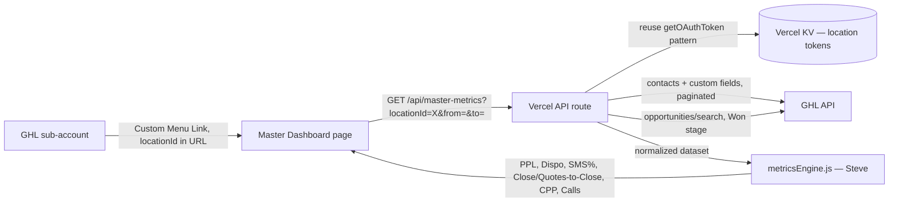

<!-- title: Master Dashboard Architecture -->

# Master Dashboard (ROI/Stats) — Architecture Plan

**Owner:** Syed (architecture + data layer + canvas) · **Calc source of truth:** Steve, dictated via huddles · **Status:** build started 2026-08-20, following John's plan · **Test client:** Haley Elder (insurance vertical)

## 0. Confirmed plan (2026-08-20, after Syed/John meeting)

John declined the QuickSight-dataset-access / AWS IAM route — not a trust issue, AWS IAM is genuinely broken on LGM's end that week. New division of labor:

- **Steve** (built the original QuickSight calculations) is the source of truth for formulas — dictates them in daily huddles or verifies our numbers against QuickSight's output. He does not need dataset/IAM access either; he already knows the logic.
- **Syed + Claude** build the foundation: the joined GHL data layer for one location, and a blank canvas ready to receive Steve's calculations.
- **Data source decision made:** live GHL API pulls (contacts + opportunities), joined in-memory on contact ID, using the existing marketplace-OAuth per-location token infrastructure (`ghl_tokens` Supabase table). This **replaces** §4's earlier open question about redirecting QuickSight's SPICE pipeline — that question is now moot, we're building fresh.
- **Scope confirmed:** replicate the QuickSight **first tab only** (Lead Details) initially. Phase 2 adds Lead Analytics, Sales Board, and a Cohort tab. All other original QuickSight tabs are retired, not replicated.

**Calculation logic confirmed by John** (partial — enough to build the data layer around, full formulas still come from Steve):
- Everything attributes to the lead's **date created**, not when the sale closed — a sale today from a 4-month-old lead counts in that lead's original month, not today's.
- PPL = (commission − lead cost) ÷ lead count; lead cost = SUM of the **"lead price"** custom field on contacts (matches the §1 reverse-engineered formula below).
- Disposition rate = contacts with a **"disposition date"** custom field filled ÷ total leads (presence-based, not a status enum).
- Call metrics = SUM of a **"call count"** custom field per contact; avg calls/lead = that ÷ lead count.
- Premium = opportunity `monetaryValue` (built-in field, not custom).
- Pivots by contact source and assigned user, with per-user above/below-average — unchanged from earlier.
- **Not yet specified by John:** exact SMS reply rate formula, and whether CPP or a CPL-style metric is wanted (§1's discrepancy is still open — ask Steve directly).

Everything in §1 below (the reverse-engineered audit) stays as reference/cross-check material — Steve's dictated formulas are authoritative when they conflict with anything reverse-engineered there.

## 0a. What's built so far (2026-08-20)

- `api/_ghlAuth.js` — shared per-location OAuth token helper, extracted from the duplicated logic in `ghl-location-data.js`/`token.js` (those two are untouched; new code uses the shared version).
- `api/master-leads.js` — `GET /api/master-leads?locationId=X&from=&to=` — pulls all contacts + all opportunities for one location (paginated, 100/page, capped at 50 pages as a safety valve), joins opportunities onto contacts by `contactId`, filters contacts to the `from`/`to` window by `dateAdded` (the date-created attribution rule from §0), and resolves the "lead price," "call count," and "disposition date" custom fields by fuzzy name-match against `/locations/{id}/customFields` — no hardcoded field IDs, so it should work on any account without per-location config, **assuming those field names are close to consistent** (the response includes `missingFields` + the full `allFields` list so a mismatch is visible immediately instead of silently returning nulls).
- `src/hooks/useMasterLeads.js` + `src/components/master/MasterDashboard.jsx` + `src/MasterStandaloneApp.jsx` — the canvas. Reads `?locationId=` from the URL (no login — access inherited from GHL embed context per §2), shows sanity-check counts (contacts scanned, opportunities scanned, leads in range) and a raw joined table. **Deliberately does not compute PPL/Dispo/SMS%/CVR/CPP yet** — this is what Steve verifies the raw rows against QuickSight before any formula gets trusted.
- Wired into the existing `VITE_APP_MODE` pattern in `App.jsx` (same mechanism as `IS_HEALTH_MODE`) — `VITE_APP_MODE=master` will need its own Vercel project + env vars when ready to deploy, same as `lgm-customer-health` was split out.
- Both builds (`npm run build` and `VITE_APP_MODE=master npm run build`) pass clean.

## 0b. Validated against real data (2026-08-20, same day) — data layer confirmed working

Tested end-to-end against Haley's real account (`locationId: EsfaSslc9A9wO3hXkJNj`) on a live deployment (`lgm-master-dashboard` Vercel project, separate from the other two, connected to the same repo). Several real bugs found and fixed along the way — noted here since they're the kind of thing that'll bite again if this pattern gets copied elsewhere:

- **GHL OAuth scope gap:** the original `/api/oauth-connect` scope list never requested `locations/customFields.readonly`. Adding it broke the whole authorize flow instead of just failing gracefully — GHL rejects the entire request if *any* requested scope isn't enabled on the app's Marketplace configuration, it doesn't just drop the unrecognized one. **Still unresolved:** someone with access to the GHL Marketplace app's settings needs to enable "Locations → Custom Fields" read scope there before this can be requested in code again. Until then, `leadPrice`/`callCount`/`dispositionDate` come back null on every lead — surfaced clearly via `customFieldsError` in the API response and a banner in the UI, not silent.
- **Opportunities pagination was fully broken, three times over:** (1) the `dateAdded`-based cursor copied from the contacts pagination doesn't work because opportunity objects don't have that field, so it silently stopped after page 1; (2) `skip`-based pagination (proven elsewhere in this codebase) is explicitly rejected by this endpoint (HTTP 422); (3) GHL's docs confirm `page`/`startAfter`/`startAfterId` are query-string params, not POST body fields — passing them in the body meant they were silently ignored. Fixed by using `?page=N` in the URL. GHL also caps page-number pagination at page 100 (10,000 records) and requires switching to `startAfter`/`startAfterId` cursor pagination beyond that — not implemented, since a 10k+ opportunity history is mostly older than any report window this needs. Capped there, surfaced via `hitPageCap` in the response.
- **Contacts pagination was truncating at an arbitrary fixed page cap** rather than stopping at the requested date boundary — fixed to stop naturally once a page's oldest contact predates `from` (GHL returns contacts newest-first), which is both correct and more efficient than a blind cap.
- **A real credentials-recovery detour:** the GHL company-level OAuth token in Supabase had gone stale and needed a fresh authorization via `/api/oauth-connect` (a live human click, not automatable). Along the way, a pre-existing local `.env.local` file with working credentials was accidentally deleted during testing — a process mistake, not a design one, but worth remembering: **read a file before deleting it**, especially anything gitignored that wasn't created this session.

**Real numbers from the live run** (3-month default window): 4,700 contacts scanned → 4,652 leads in range, 10,000 opportunities scanned (capped) → 2,256 attached to in-range leads, 77 won (\$182k premium). Compare to QuickSight's reference numbers for the same account/window: 1,937 leads, 58 won (\$133k premium). The mechanics are validated — pagination is clean (zero duplicate contact IDs), the join is sound, and won-rate scaling (1.3x) is proportionally much smaller than the leads-count gap (2.4x), which points to QuickSight applying a narrower "what counts as a lead" filter rather than anything broken here.

**Two things now need the team, not more engineering:**
1. **Enable the custom-fields OAuth scope** on the GHL Marketplace app (Settings → Scopes → Locations → Custom Fields), then re-run `/api/oauth-connect` once more — unblocks lead price / call count / disposition date.
2. **Define what counts as a "lead"** for this dashboard vs. QuickSight's narrower definition — likely a tag, source, or contact-type filter QuickSight applies that this pull doesn't yet. Needs Steve or John's input, not a guess.

## 0c. Fixed: blank white page (2026-08-20)

The deployed site rendered completely blank — zero DOM content, not a styled error state. Root cause: `App.jsx` statically imported both `HealthStandaloneApp` and `MasterStandaloneApp` at the top of the file. ES modules run their top-level code on *import*, not on render, so both apps' full dependency trees loaded and executed regardless of which mode actually rendered — including `src/lib/supabase.js`, which calls `createClient()` immediately using `VITE_SUPABASE_URL`/`VITE_SUPABASE_ANON_KEY`. Those client-side env vars only existed on the other two Vercel projects, never on this new one, so `createClient(undefined, undefined)` threw before React ever mounted.

Fixed two ways: (1) set the missing client-side Supabase env vars on `lgm-master-dashboard` — `VITE_SUPABASE_URL` is a public project ref, `VITE_SUPABASE_ANON_KEY` is explicitly the browser-safe key, neither is sensitive; (2) converted the `HealthStandaloneApp`/`MasterStandaloneApp` imports in `App.jsx` to `React.lazy` + `Suspense`, code-splitting each into its own chunk that only loads when actually rendered — the real architectural fix, isolating each mode's dependencies from the others going forward.

**Known residual fragility, not fixed:** `App.jsx`'s own QC-mode hooks (`useCoachingStatus`, `useActionStatus`) also import `lib/supabase.js` unconditionally, since they're part of App.jsx's own top-level (non-lazy) imports rather than inside the lazy-loaded Health subtree. Master mode's initial bundle still evaluates that module — currently harmless since the env vars are now set, but the isolation isn't complete. Would need App.jsx's QC body split out too to fully fix; not done here, lower priority than the two open items above.

## 1. What the real QuickSight dashboard actually contains

**Data source:** a QuickSight SPICE dataset named `ckf683_ghl_leads_...`, joined to a related `ckf683_ghl_oppo...` (opportunities) dataset via `assignedTo[...]` lookups. SPICE is QuickSight's imported/cached snapshot — something already syncs GHL leads + opportunities into this dataset on a schedule. **Open question, not yet answered:** what actually populates it — a direct GHL→S3/Athena job, a manual CSV upload, an n8n workflow? This matters a lot: if a working sync already exists, redirecting its output into Supabase is far faster and more accurate than rebuilding a live-GHL-API puller from scratch. Confirm before committing to the data-layer approach in §4.

**Tabs found** (top nav, likely more beyond what's visible): Lead Details, Sales Board, Lead Analytics, Bad Lead Trends, Marketing Weekly, Sales Weekly, Marketing Monthly, Sales Monthly, Marketing Quarterly (+ possibly more, cut off in the screenshot). This is **far larger than the original 4-view scope** (Overview / Cohort / Agent Breakdown / digest) assumed. Treat that original scope as an MVP slice of "Lead Details" only — see §7 for a phased recommendation rather than silently trying to match all 9+ tabs at once.

**Confirmed formulas** (reverse-engineered from the real Total row — $12,812 lead cost, $13,972 commission, 58 sales, 1,937 leads, 7,697 calls — and cross-checked against a per-owner row including a negative-profit case):

| Metric | Formula | Verified |
|---|---|---|
| Profit | Commission − Lead Cost | $13,972 − $12,812 = $1,160 ✓ |
| PPL (Profit Per Lead) | Profit ÷ Leads | $1,160 ÷ 1,937 = $0.60 ✓ (also verified on Ashley Watson row: −$1,334 ÷ 554 = −$2.41 ✓) |
| CPP (Cost Per Policy) | Lead Cost ÷ **Sale Count** | $12,812 ÷ 58 = $221 ✓ |
| Dispo Rate | Dispositioned Leads ÷ Total Leads | 99% |
| SMS Reply Rate | SMS Replies ÷ SMS Sent | 42% |
| Quote Rate | Quoted Leads ÷ Total Leads | 49% |
| Close Rate | Sales ÷ Total Leads | 58 ÷ 1,937 = 3.0% ✓ |
| Quotes-to-Close Rate | Sales ÷ Quoted Leads | ≈58 ÷ 949 = 6.1% ✓ — **this is the number shown as the headline "Conv. Rate" (6.09%) tile**, not Close Rate |
| Calls per Lead | Total Calls ÷ Total Leads | 7,697 ÷ 1,937 = 3.97 ✓ |
| Calls to Close | unconfirmed — top-level KPI = 2.67, distinct from Calls per Lead (3.97). Best guess: avg calls made specifically on **won** leads. Needs formula readout (open the calculated field in QuickSight) to confirm. | — |
| Bad Lead Rate | Bad Leads ÷ Total Leads | 5% |
| Rate Too High Rate | Leads lost to "rate too high" reason ÷ Total Leads | 4% — insurance-specific disqualifier |

**⚠️ Two discrepancies vs. the original task spec — need a team decision, not a silent pick:**

1. **CPP ≠ CPL.** The real dashboard's cost metric (CPP, "Cost Per Policy") divides Lead Cost by **Sale Count**. The original spec's "CPL = totalAdSpend ÷ totalLeads" divides by **Leads** instead — a completely different number (~$6.61 here, vs. $221). Confirm which one the new dashboard needs — possibly both, labeled distinctly.
2. **Two different "conversion rate" metrics coexist.** Close Rate (Sales÷Leads, 3.0%) and Quotes-to-Close Rate (Sales÷Quotes, 6%) are both present as separate columns. The headline KPI uses Quotes-to-Close, not the simpler Sales÷Leads definition the original spec described as "CVR." Confirm which is "the" conversion metric for the new build's headline KPI.

**Pivots are three-dimensional, not two.** Real tables found: Lead Source Metrics (by `source`), Assigned Owner Metrics (by `assignedTo`), **and Lead Profile/Campaign Metrics** (by a `Lead Profile` custom field, e.g. "Home", "SmartFinancialAuto - 75...") — a third dimension not in the original scope.

**Other visuals found, not in original scope:**
- Sales Stage funnel donut (X-dated 65%, Requote 0%, Quoted 15%, Policy Sold 3%, Pending Contact 10%, Bad Lead 5%)
- Weekly trend combo chart — bar (count) + line (rate %) over week buckets, e.g. "Rate too high rate by Date Created"
- Raw Lead Details drill-down table — record-level rows (Date Created, Name, Lead Source, Lead Profile, Sales Stage, Bad Lead Reason, Owner, phone)

**⚠️ Vertical-schema risk.** Haley Elder is an **insurance** account — `Written Premium`, `X-dated`, `Rate too high`, `Auto Policy Expiration Date` are insurance-specific fields and sales stages. If other LGM clients aren't insurance agencies, their GHL custom-field schemas (and possibly their sales-stage names) won't match this one at all. This directly affects §4's field-mapping approach: **confirm whether Master Dashboard v1 targets insurance-vertical clients only (matching this schema) or must generalize across LGM's full client base.** If it's the latter, a single hardcoded field-name map won't work and the field-mapping layer needs to be config-driven per vertical or per account.

---

## 2. What this replaces and where it lives

QuickSight (`lgm-stat`) goes away entirely (~$2,600/mo). This is **embedded directly inside GHL**, per sub-account, via a GHL Custom Menu Link (iframe) — not a standalone app clients log into separately. GHL injects the sub-account's `location.id` into the iframe URL; the page reads it and renders that one account's numbers. No new login system needed — access is inherited from the client already being inside their own GHL account.

```
GHL sub-account (client logged in)
  └─ Custom Menu Link → iframe
       src="https://<dashboard-domain>/master?locationId={{location.id}}"
```

**Open decision:** GHL Custom Menu Link query params are not cryptographically verified — a technically inclined client could edit the URL and pass a different `locationId` to see another account's numbers. A full GHL Marketplace App with SSO context (encrypted user/location payload via `postMessage`) closes this gap but is a bigger build. Flagging for the huddle — not blocking the first build, since this is a common tradeoff other embedded-dashboard vendors accept.

## 3. Reuse: this already has a working foundation

No new OAuth or token infrastructure is needed. `api/ghl-location-data.js` already implements exactly the pattern this needs:

- Per-`locationId` access token, stored in Vercel KV (Upstash), refreshed on expiry
- Falls back to re-deriving a location token from the agency company token if the stored one is dead
- `Promise.allSettled` fan-out to multiple GHL endpoints scoped to one `locationId`

The new API route(s) for this dashboard extend that same token-fetch helper — copy `getOAuthToken(locationId)` rather than rebuilding it.

## 4. Data flow



Because each dashboard instance only ever loads **one** `locationId` at a time (embedded per sub-account, not aggregating across all clients like Customer Health does), a live-fetch-with-short-edge-cache pattern is likely sufficient for the per-account API route — no bulk pre-sync table needed there.

**But this now competes with the SPICE-dataset question from §1.** If there's already a working pipeline populating `ckf683_ghl_leads_...`, the better architecture may be: keep that pipeline (or redirect its output), land it in a Supabase table (mirroring the `agency_lc_raw` pattern), and have the dashboard read from Supabase instead of live GHL calls per page load — much cheaper and faster than paginating a full lead history live on every visit, especially for high-volume accounts (this test account alone has 1,937 leads in 3 months). **Recommendation: find out what feeds SPICE today before building the live-fetch API route — it may make that route unnecessary.**

## 5. Custom field mapping

Every metric depends on GHL **custom fields** and built-in fields already present on contacts/opportunities:

| Metric input | GHL source |
|---|---|
| Lead cost | "lead price"-style custom field, summed |
| Disposition | disposition custom field |
| SMS sent/replied | custom field or conversation-derived count |
| Call count | custom field or call-activity count |
| Contact source | built-in `source` field on contact |
| Lead Profile / campaign | custom field (third pivot dimension, §1) |
| Assigned user | built-in `assignedTo` on contact |
| Bad Lead Reason / X-dated Reason | custom fields (insurance-specific) |
| Written Premium / opportunity value | Opportunities API, `monetaryValue` |
| Won / Sales Stage | Opportunities API, pipeline stage |

**Open decision (unchanged from before, now sharper given the vertical-schema risk in §1):** are custom field **IDs** identical across all sub-accounts because they share one GHL Snapshot (`ghlSnapshotId`, already tracked in `ghl-accounts.js`), or do they vary per account/vertical? If insurance and non-insurance clients use different snapshots, this needs a per-vertical (or per-`locationId`) field-ID resolver, not one hardcoded map. **Action for Syed:** check `ghlSnapshotId` consistency across a few live accounts, including at least one non-insurance client if one exists, before Steve starts wiring field IDs.

## 6. `metricsEngine.js` — contract for Steve

Mirror the pure-function, no-side-effects pattern of `src/lib/healthEngine.js`. Updated to match confirmed formulas from §1 — Steve owns implementation, this fixes the interface so the two halves plug together:

```js
// Input: normalized arrays, not raw GHL payloads — the API route does the GHL-shape parsing.
computeMetrics({ contacts, opportunities, dateRange })
// → {
//     leads, profit, ppl,              // profit = commission - leadCost; ppl = profit / leads
//     dispoRate, smsReplyRate, quoteRate,
//     closeRate,            // sales / leads
//     quotesToCloseRate,    // sales / quotes  — this is the headline "Conv. Rate"
//     cpp,                  // leadCost / saleCount
//     calls: { total, avgPerLead, avgOnWonLeads },
//     badLeadRate, rateTooHighRate,
//   }

pivotBy({ contacts, opportunities, dimension: 'source' | 'assignedUser' | 'leadProfile' })
// → [{ key, ...computeMetrics-shaped fields, vsAvg: { ppl: 'above'|'below', ... } }]
// three dimensions per §1, not two

groupByCohort({ contacts, opportunities, cohortBy: 'leadDate' | 'soldDate' })
// → [{ cohort: 'Jan 2026', leadsIn, sold, ...metrics }]

salesStageBreakdown({ opportunities })
// → [{ stage: 'X-dated' | 'Requote' | 'Quoted' | 'Policy Sold' | 'Pending Contact' | 'Bad Lead', count, pct }]
```

Same rule as `healthConfig.js`: no thresholds or weights inline — one config file Steve edits, not scattered constants. Metric **names** (CPP vs CPL, Close Rate vs Quotes-to-Close) should resolve the §1 discrepancies before this gets built, not be guessed inside the implementation.

## 7. Views — phased, not all-at-once

The real dashboard has 9+ tabs; matching all of them in one pass is a much bigger project than originally scoped. Recommend phasing:

| Phase | Tab | Contents | Owner |
|---|---|---|---|
| 1 (MVP) | Overview | KPI cards matching §1's confirmed metrics + date filter (7d/30d/90d/custom), scoped to lead date-created | Steve (calc) + Syed (shell) |
| 1 (MVP) | Lead Source / Agent / Profile breakdown | The three pivot tables from §1, sortable, above/below-average highlighting per user | Steve |
| 1 (MVP) | Sales Stage funnel | Donut chart matching QuickSight's stage breakdown | Syed |
| 2 | Cohort | Leads-in vs. when-sold, grouped by cohort period | Steve |
| 2 | Trend charts | Weekly combo bar+line pattern, per metric | Syed |
| 2 | Lead Details drill-down | Raw record-level table | Syed |
| 3 | Sales Board / Lead Analytics / Bad Lead Trends / Marketing & Sales Weekly/Monthly/Quarterly | Not yet audited — scope these once Phase 1/2 ship and the team has a read on what clients actually use vs. ignore | TBD |
| Future | Daily digest email | "Yesterday's activity" summary — explicitly future-scoped by the team already | — |

**DM tab:** working assumption unchanged — DM = Digital Marketing clients (vs. a possible future Agent/AI-product equivalent), per the existing split in `DmAgentBreakdown.jsx`. Still needs explicit team confirmation; not yet resolved.

## 8. Security notes

- `agency_lc_raw` and `allagent_lc_raw` in Supabase have **RLS disabled** — fully exposed to the anon key. Not used by this dashboard directly, but flagging since it's a live gap in the same project. Recommend enabling RLS with a service-role-only policy — holding off on applying until confirmed no client-side code reads these tables directly.
- `GHL_AGENCY_API_KEY`, `SUPABASE_SERVICE_KEY`, OAuth client secret all stay server-side (Vercel env vars / API routes only) — same rule as the rest of the project, nothing new here.
- The Custom-Menu-Link `locationId` trust question in §2 is the one genuinely new security surface this project introduces.

## 9. Build order

1. **Find out what populates the `ckf683_ghl_leads_...` SPICE dataset today** — determines whether §4's data layer is "redirect an existing pipeline into Supabase" or "build live GHL pulls from scratch." Biggest lever on effort of anything in this doc.
2. **Resolve the two discrepancies in §1** (CPP vs CPL, Close Rate vs Quotes-to-Close) and the vertical-schema question — quick huddle items, but they change field names Steve builds against.
3. Pull exact formula text for the unconfirmed fields (Calls to Close, "gross close rate," "New Customers") directly from QuickSight's calculated-field editor — doesn't need AWS API access, just opening each field in the UI.
4. `api/master-metrics.js` (or the Supabase-read equivalent, depending on #1) — scoped to one `locationId` + date range
5. `src/lib/metricsEngine.js` (Steve) — pure functions per §6, against real field data
6. Phase 1 views per §7 (Syed + Steve)
7. Phase 2, then Phase 3 tabs — scoped later, once Phase 1 ships
